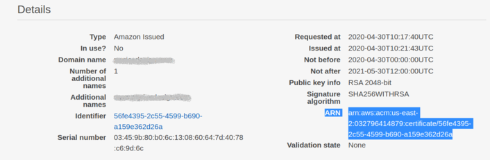

# Terraform AWS CI/CD Infrastructure

## Overview

The infrastructure in this project is designed using Hashicorp language and implemented with Terraform CLI. It supports a a decoupled back-end and front-end application architecture. Both application have separate pipelines which pull from different GitHub repos, this allows development of each layer to operate independently. Both pipelines are triggered by a git push to the main repo. The backend API is designed to support a GraphQL API hosted on AWS ECS and is network balanced by an Auto scalling group and Application load balancer. The front-end application is build in the pipeline and hosted on an S3 bucket and AWS CloudFront.

### Main Features

- :star: Decoupled front and backend-ends
- :star: Front Application served worldwide CDN with AWS CloudFront
- :star: Resilient and Highly available back-end API with Autoscalling and network load balancing
- :star: Secure connection with SSL certificate on AWS Route 53
- :star: Redirect all http://www.domain.com traffic to https://domain.com
- :star: AWS CodePipeline which automates application deployment
- :star: Secure VPC
- :star: Secure application logs for high visibility into application, including Athena ALB logs

### Pre-requisites (if not follow the how to's):

- :warning: Route 53 Hosted Domain
- :rotating_light: SSL Certificate ARN (AWS Certificate Manager) - the certificate must be in the **US East (N. Virginia)us-east-1** region
- :warning: Terraform Backend S3 Bucket
- :warning: Terraform CLI is installed
- :warning: Front-end ReactJS application GitHub repo
- :warning: Back-end GraphQL API GitHub repo
- :warning: AWS CodeStar connection
- :warning: AWS ECR repository

**Note**
Check the [How-to's](#how-to) at the bottom of this repo if you need more help

---

## Get Started:

1. Ensure all pre-requisites are complete
2. Rename "terraform.tfvars.example" to "terraform.tfvars"
3. Enter all variables into the "terraform.vars" file

### The following resources will be created

Diagram of resources to cone

**Note**
All resource are Created in "us-east-1" region

### Terraform Variables Explained

terraform.tfvars

```hcl
# ------
# General
# ------
tags = {
  "Name" = "your-app-name",
  "Project" = "your-project-name"
  "Environment" = "production"
}

aws_account_id = "your-account-id"
github_account = "your-account"

# ------
# Repositories
# ------
api_github_repo = {
  "url" = "git@github.com:your-account/backend-repo.git",
  "name" = "your-app-name",
  "prod_branch" = "main",
  "staging_branch" = "staging"
}

frontend_github_repo = {
  "url" = "git@github.com:your-account/frontend-repo.git",
  "name" = "your-app-name",
  "prod_branch" = "main",
  "staging_branch" = "staging"
}

# ------
# ECS
# ------
api_ecr_app_uri = "your-ecr-api-uri"

# ------
# Domain
# ------
domain_name = "your-domain.com"
ssl_cert_arn = "your-certificate-arn"

# ------
# VPC
# ------
vpc_cidr = "10.0.0.0/16"

private_subnet_cidrs = [
  "10.0.50.0/24",
  "10.0.51.0/24",
]

public_subnet_cidrs = [
  "10.0.0.0/24",
  "10.0.1.0/24",
]

availability_zones = [
  "us-east-1a",
  "us-east-1b",
]

# ------
# Build Secrets
# ------
build_secrets = {
    DB_NAME:"supersecret"
    DB_USER:"supersecret"
    DB_PASSWORD:"supersecret"
    DB_HOST:"supersecret"
    DB_PORT:"supersecret"
    SECRET_KEY: "supersecret",
    EMAIL:"supersecret",
    DEBUG: "supersecret",
    ALLOWED_HOSTS: "supersecret",
    CSRF_TRUSTED_ORIGINS:"supersecret"
    AWS_MEDIA_BUCKET_NAME: "supersecret",
    AWS_STORAGE_BUCKET_NAME: "supersecret",
    AWS_ACCESS_KEY_ID: "supersecret",
    AWS_SECRET_ACCESS_KEY: "supersecret",
    DOCKER_USERNAME: "supersecret",
    DOCKER_PASSWORD: "supersecret"
    GITHUB_WEBHOOK_SECRET:"supersecret"
    REACT_APP_URI:"supersecret"
  }
```

---

## How to:

- [Route 53 hosted Domain](#route-53)
- [SSL Certificate associated with that domain](#ssl-certificate)
- [Terraform Backend S3 Bucket](#terraform-bucket)
- [Terraform CLI is installed](#terraform-cli)
- [GitHub repository which contains a ReactJS application](#front-end-github-repo)
- [GitHub repository which contains a Django GraphQL application](#back-end-github-repo)
- [AWS CodeStar connection](#aws-codestar)
- [AWS ECR repository](#aws-ecr-repository)

### Route 53

Create a hosted domain in Route53

[https://console.aws.amazon.com/route53](https://console.aws.amazon.com/route53)

1. If you don't already have a domain registered with another registrar, you will first need to register a domain. This can be done in the main Route53 dashboard, it can take up to 24 hours for domain to be active
2. If you have a domain hosted with another registrar, click on "Hosted zones" on the sidebar
3. Click create hosted zones - you will then have a hosted zone with 2 record sets, NS and SOA records
4. If you have a domain registered with another registrar, add AWS NS servers to current hosted domain, depending on provider you will have to follow their instructions to point your domain to AWS Route 53

### SSL Certificate

Create an SSL certificate, follow the link to the Certificate Manager Console

[https://console.aws.amazon.com/acm](https://console.aws.amazon.com/acm)

Note: **Be sure to create the certificate within "US East (N. Virginia) us-east-1"**

1. Change region to **US East (N. Virginia) us-east-1**
2. Click -> "Request a certificate"
3. Check -> "Request a public certificate" and then Click -> "Request a certificate"
4. Enter -> "myexampledomain.com"
5. Click -> "Add another name to this certificate"
6. Enter -> "www.myexampledomain.com" and then Click -> "Next"
7. Check -> "DNS validation" and Click -> "Next"
8. Click -> "Review" and then Click -> "Confirm and request"

Once the certificates are created you will need to add them to the Route53 hosted zone. There are a few ways to do it, the easiest way is to click "Create record in Route 53" under each domain name. This will automatically add the CNAME record to your hosted zone.

Once the certificates are added to your hosted zone, wait a few minutes for the certificates to validate and then click "Continue".

After the certificates are validated, copy the ARN number of the certificate. This will be used as input for the CloudFormation template.

**Copy the ARN of the certificate**



### Terraform Backend Bucket

Run the following command:

    aws s3api create-bucket --bucket terraform-backend

### Terraform CLI

### Front-end GitHub Repo

Clone this repo if you don't already have a Gatsby site

    git clone git@github.com:subaquatic-pierre/gatsby-pipeline-app.git

### Back-end GitHub Repo

Clone this repo if you don't already have a Gatsby site

    git clone git@github.com:subaquatic-pierre/gatsby-pipeline-app.git

#### AWS CodeStar

Go to AWS Console

#### AWS ECR repository

Use the following command
